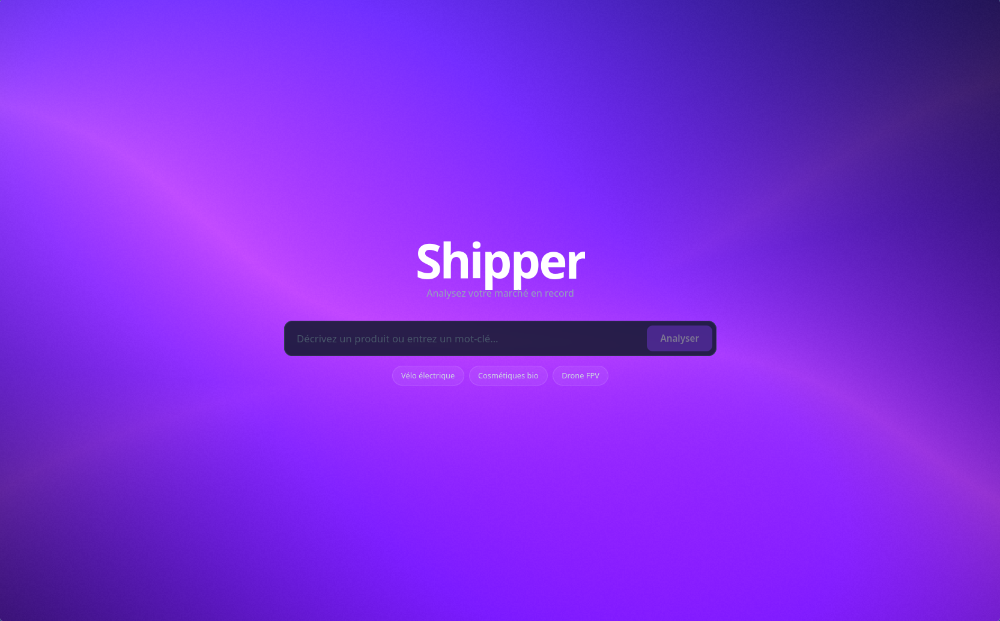
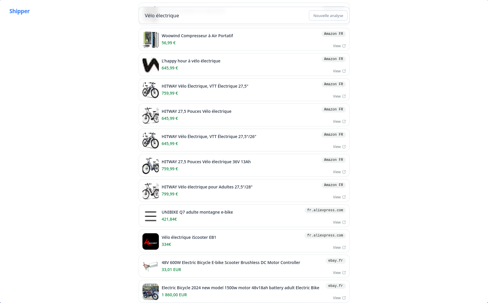
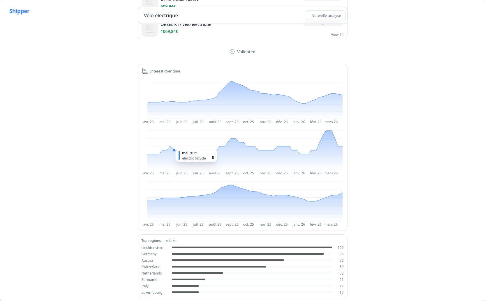

# Shipper

**Transformez une idée produit en décision fondée — en quelques minutes.**

Shipper est une plateforme d'intelligence marché propulsée par l'IA. Décrivez un produit en langage naturel : le système lance un pipeline agentique qui analyse la concurrence sur les marketplaces, mesure l'intérêt sur Google Trends, synthétise tout via LLM, et vous livre un verdict clair — go ou no-go — avec les risques, les opportunités et un rapport exportable.





---

## Comment ça marche

```
Vous décrivez votre produit
        ↓
Shipper affine vos mots-clés et vous les soumet (validation humaine)
        ↓
Scraping Amazon · Google Trends
        ↓
Analyse IA : score de viabilité · persona · différenciation · concurrence
        ↓
Verdict go/no-go + rapport Markdown / PDF
```

Chaque étape est visible en temps réel. Vous gardez la main : le workflow s'arrête pour vous demander confirmation avant de continuer.

---

## Stack

| Couche | Technologie |
|--------|-------------|
| Frontend | SvelteKit + Svelte 5 (runes) |
| UI & icônes | shadcn-svelte · HugeIcons · layerchart |
| Background | WebGL shader (canvas animé) |
| Backend | FastAPI + Python 3.12 |
| Package managers | uv (backend) · npm (frontend) |
| Transport | WebSocket (streaming temps réel) |
| LLM | [OpenHosta](https://github.com/hand-e-fr/OpenHosta) → OpenAI |
| Scraping | httpx + BeautifulSoup4 |
| Tendances | pytrends (Google Trends) |
| Export | fpdf2 (PDF) · Markdown natif |

---

## Lancer le projet

### Prérequis

- [uv](https://docs.astral.sh/uv/getting-started/installation/) — gestionnaire Python
- Node.js + npm
- Une clé API OpenAI
- *(Optionnel)* Une clé [ScraperAPI](https://www.scraperapi.com/) pour le scraping en production

### 1. Variables d'environnement

```bash
cp backend/.env.example backend/.env
```

Éditer `backend/.env` :

```env
APP_OPENAI_API_KEY=sk-...
APP_LLM_MODEL=gpt-4o-mini
APP_CORS_ORIGINS=["http://localhost:5173"]
APP_SOURCE_TIMEOUT=10
SCRAPERAPI_KEY=        # optionnel
```

### 2. Backend

```bash
cd backend
uv sync
uv run uvicorn src.main:app --reload --port 8000
```

### 3. Frontend

```bash
cd frontend
npm install
npm run dev
```

- Frontend : **http://localhost:5173**
- Backend : **http://localhost:8000/health**

---

## Pipeline — les 9 étapes

| # | Étape | Description |
|---|-------|-------------|
| 1 | Description | Nettoyage et structuration de la description produit |
| 2 | Keyword Refinement | Génération de mots-clés SEO pertinents via LLM |
| 3 | Keyword Confirmation | **Validation humaine** — vous confirmez ou corrigez |
| 4 | Product Research | Scraping Amazon : produits, prix, notes, avis |
| 5 | Product Validation | Filtrage et pertinence des résultats (LLM) |
| 6 | Market Research | Google Trends : évolution temporelle + intérêt par région |
| 7 | AI Analysis | Synthèse complète : score, persona, différenciation, concurrence |
| 8 | Final Criteria | Extraction du verdict go/no-go + risques + opportunités |
| 9 | Report | Rapport final disponible en téléchargement |

---

## API

### WebSocket — `ws://localhost:8000/ws/workflow`

**Client → Serveur**

```json
{ "type": "start", "description": "vélo électrique pliable urbain" }
{ "type": "confirmation", "step_id": "keyword_confirmation", "confirmed": true }
{ "type": "user_input", "step_id": "...", "data": { "description": "..." } }
{ "type": "retry", "step_id": "..." }
```

**Serveur → Client**

```
workflow_started        total_steps
step_activated          step_id, step_number, label
step_processing         step_id
step_streaming_token    step_id, token
step_result             step_id, component_type, data
confirmation_request    step_id, component_type, data
step_error              step_id, error, retryable
workflow_complete       run_id
```

### Export — REST

```
GET /api/export/{run_id}/markdown   → rapport .md
GET /api/export/{run_id}/pdf        → rapport .pdf
GET /health                         → {"status": "ok"}
```

---

## Structure

```
.
├── backend/
│   └── src/
│       ├── main.py                    # App FastAPI
│       ├── config.py                  # Config pydantic-settings
│       ├── scraper.py                 # Scraping Amazon
│       ├── store.py                   # État en mémoire (runs)
│       ├── routes/
│       │   ├── workflow.py            # WebSocket /ws/workflow
│       │   └── export.py             # Exports Markdown + PDF
│       ├── logic/
│       │   └── export.py             # Rendu Markdown + fpdf2
│       └── workflow/
│           ├── engine.py              # Moteur agentique
│           ├── registry.py            # Déclaration du pipeline
│           ├── step_base.py           # Classe de base StepBase
│           └── steps/                 # s01 → s09
└── frontend/
    └── src/
        ├── lib/
        │   ├── ws.ts                  # Wrapper WebSocket
        │   ├── workflow-types.ts      # Types Zod
        │   └── components/
        │       ├── ShaderBackground.svelte
        │       ├── StepRenderer.svelte
        │       ├── charts/            # Courbes, régions, score
        │       ├── steps/             # Composants par étape
        │       └── ui/                # shadcn-svelte
        └── routes/
            └── workflow/+page.svelte  # Page principale
```

---

Construit avec [OpenHosta](https://github.com/hand-e-fr/OpenHosta) — la librairie open-source de [Hand-e](https://hand-e.net) qui transforme des fonctions Python typées en appels LLM.
